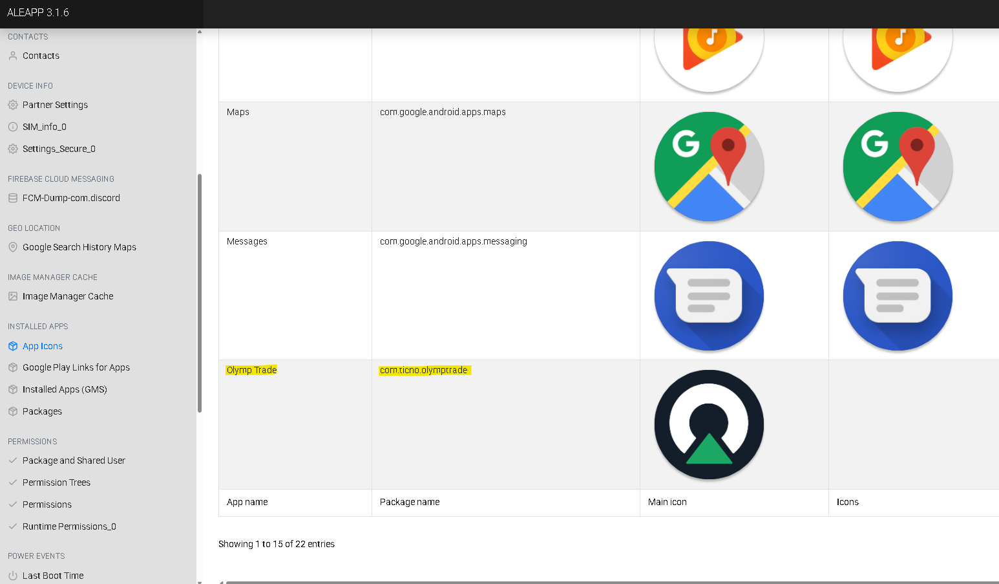
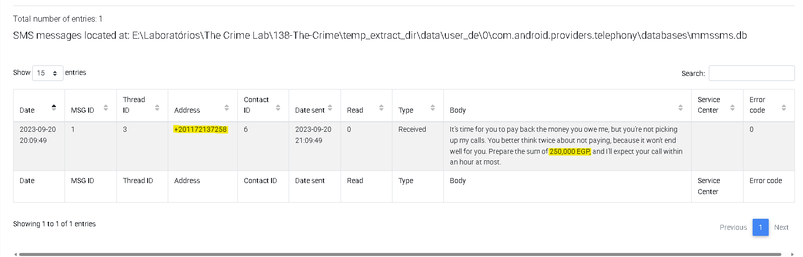
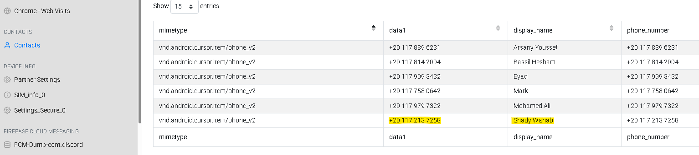
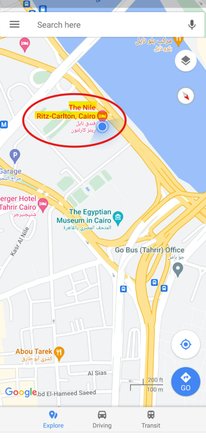

# 🕵️ DFIR Investigation - The Crime Lab

## 📌 Overview

Este projeto documenta uma investigação forense digital realizada a partir da análise de dados extraídos de um dispositivo móvel.

Foi utilizada a ferramenta **ALEAPP (Android Logs Events And Protobuf Parser)** para identificar atividades suspeitas e reconstruir os eventos relacionados ao caso.

---

## 🛠️ Tools Used

* ALEAPP
* SQLite
* SHA-256 Hash

---

## 🔍 Step 1 - Installed Applications Analysis

Durante a análise dos aplicativos instalados, foi identificado o app:

* **Olymp Trade**
* Package: `com.ticno.olymptrade`

Após a identificação, foi analisado o **SHA-256 Hash** do aplicativo para validação da integridade da evidência.

---

## 📩 Step 2 - SMS Analysis

Na análise dos SMS, foi encontrada uma mensagem indicando uma possível cobrança de dívida com tom de ameaça.

* Valor: **250.000 EGP**

---

## 👤 Step 3 - Contact Identification

A partir da base de contatos, foi possível identificar um indivíduo relevante para a investigação:

* **Nome:** Shady Wahab
* **Telefone:** +20 117 213 7258

---

## 📍 Step 4 - Location Analysis

Na seção de **Recent Activity**, foi encontrada uma imagem indicando uma possível localização:

* **Local:** The Nile Ritz-Carlton (Cairo)

---

## ✈️ Step 5 - Travel Evidence

Foi identificado um arquivo dentro do diretório do dispositivo:

* Caminho:
  `/data/media/0/Download/PlaneTicket.png`

A imagem revela uma passagem aérea com o seguinte trajeto:

* **Origem:** Cairo
* **Destino:** Las Vegas

---

## 🧪 Step 6 - SQLite WAL Analysis

Na análise de **SQLite Journal & WAL**, foi possível recuperar dados adicionais.

Ao realizar um filtro pela palavra-chave **"meet"**, foi encontrada a seguinte informação:

> "We'll meet at The Mob Museum"

Isso indica um possível local de encontro planejado.

---

## 📊 Timeline Reconstruction

| Etapa | Evento                                      |
| ----- | ------------------------------------------- |
| 1     | Identificação de mensagem de dívida         |
| 2     | Detecção de aplicativo suspeito             |
| 3     | Identificação de contato                    |
| 4     | Indício de localização em Cairo             |
| 5     | Descoberta de viagem para Las Vegas         |
| 6     | Identificação de encontro no The Mob Museum |

---

## 🚨 Key Findings

* Presença de aplicativo relacionado a atividade suspeita
* Evidência de possível coerção financeira via SMS
* Identificação de contato relevante
* Registro de deslocamento internacional
* Planejamento de encontro em local específico

---

## 🔐 Evidence Validation

* Dados extraídos utilizando **ALEAPP**
* Integridade verificada via **SHA-256 Hash**
* Informações recuperadas a partir de arquivos **SQLite WAL**

---

## 🧠 Skills Demonstrated

* Mobile Forensics (Android)
* Análise de artefatos com ALEAPP
* Análise de banco de dados SQLite
* Correlação de evidências
* Reconstrução de timeline

---

## 📎 Conclusion

A investigação permitiu identificar uma sequência de eventos envolvendo possível dívida, deslocamento internacional e planejamento de encontro.

Este projeto demonstra a capacidade de coletar, analisar e correlacionar evidências digitais de forma estruturada.
