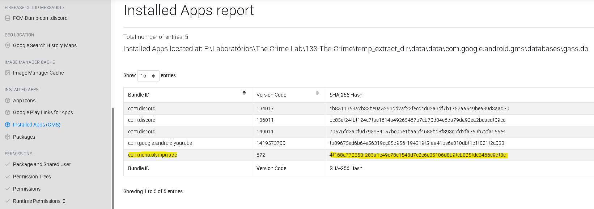
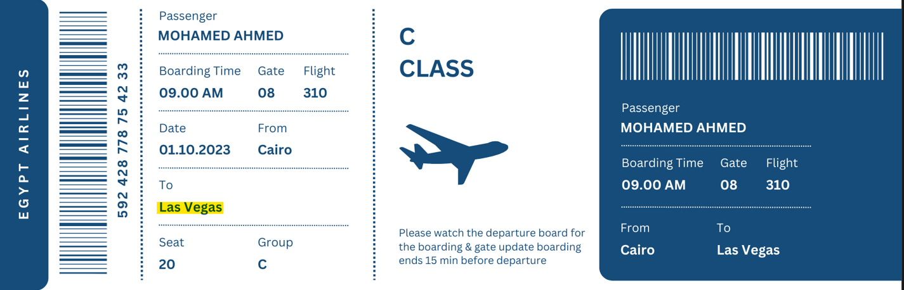
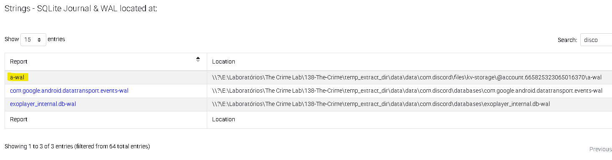
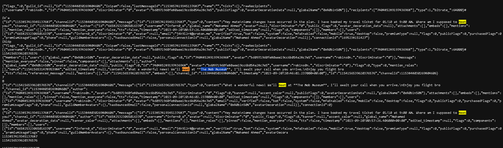

# 🕵️ DFIR Investigation - The Crime Lab

## 📌 Overview

Este projeto documenta uma investigação forense digital realizada a partir da análise de artefatos extraídos de um dispositivo Android.

A análise foi conduzida utilizando a ferramenta **ALEAPP (Android Logs Events And Protobuf Parser)**, com o objetivo de identificar atividades suspeitas, correlacionar evidências e reconstruir a sequência de eventos do caso.

---

## 🛠️ Tools Used

* ALEAPP
* SQLite Database Analysis
* SHA-256 Hash

---

## 🔍 Step 1 - Installed Applications Analysis

A análise inicial foi realizada sobre os aplicativos instalados no dispositivo.

Foi identificado o seguinte aplicativo:

* **Olymp Trade**
* Package: `com.ticno.olymptrade`

A presença desse aplicativo pode indicar atividade financeira relevante no contexto da investigação.

Além disso, foi analisado o **SHA-256 Hash** do aplicativo para verificação de integridade e possível correlação com bases de ameaça.

---

## 📩 Step 2 - SMS Analysis

A análise foi realizada sobre o banco de dados de mensagens (`mmssms.db`), contendo registros de SMS do dispositivo.

Foi identificada uma mensagem com conteúdo de possível coerção financeira:

* Valor mencionado: **250.000 EGP**

O conteúdo da mensagem sugere pressão ou ameaça relacionada a uma dívida.

---

## 👤 Step 3 - Contact Identification

A partir da base de contatos do dispositivo, foi identificado um indivíduo relevante para a investigação:

* **Nome:** Shady Wahab
* **Telefone:** +20 117 213 7258

Este contato pode estar diretamente relacionado à mensagem identificada anteriormente.

---

## 📍 Step 4 - Location Analysis

Na análise de **Recent Activity**, foi encontrada uma imagem indicando uma possível localização do dispositivo:

* **Local:** The Nile Ritz-Carlton (Cairo)

Essa informação sugere a presença física do usuário em Cairo durante o período analisado.

---

## ✈️ Step 5 - Travel Evidence

Durante a análise do sistema de arquivos, foi identificado o seguinte artefato:

* Caminho:
  `/data/media/0/Download/PlaneTicket.png`

A imagem corresponde a uma passagem aérea com o seguinte trajeto:

* **Origem:** Cairo
* **Destino:** Las Vegas

Essa evidência indica deslocamento internacional relevante para o contexto da investigação.

---

## 🧪 Step 6 - SQLite WAL Analysis

A análise avançada foi realizada sobre arquivos **SQLite Journal & WAL**, especificamente o arquivo `a-wal`.

Arquivos WAL (Write-Ahead Logging) armazenam dados temporários que ainda não foram gravados no banco principal, sendo uma fonte importante para recuperação de evidências.

Durante a análise, foi aplicado um filtro pela palavra-chave **"meet"**, resultando na identificação da seguinte informação:

> "We'll meet at The Mob Museum"

Essa evidência indica o planejamento de um encontro em local específico.

---

## 📊 Timeline Reconstruction

| Etapa | Evento                                               |
| ----- | ---------------------------------------------------- |
| 1     | Recebimento de mensagem com cobrança de dívida       |
| 2     | Identificação de aplicativo financeiro suspeito      |
| 3     | Identificação de contato relevante                   |
| 4     | Registro de localização em Cairo                     |
| 5     | Descoberta de passagem aérea para Las Vegas          |
| 6     | Identificação de encontro planejado (The Mob Museum) |

---

## 🧠 Analysis

A correlação das evidências permite identificar a seguinte sequência de eventos:

* O dispositivo recebeu uma mensagem indicando cobrança de dívida com possível caráter coercitivo
* Um contato específico (Shady Wahab) pode estar associado a essa comunicação
* O usuário esteve localizado em Cairo
* Foi identificada uma passagem aérea para Las Vegas
* Há evidência de um encontro planejado no local **The Mob Museum**

Esses elementos sugerem um possível cenário envolvendo coerção financeira, deslocamento internacional e encontro previamente organizado.

---

## 🚨 Key Findings

* Evidência de possível coerção financeira via SMS
* Identificação de contato relevante para o caso
* Registro de localização física do usuário
* Indícios de deslocamento internacional
* Planejamento de encontro em local específico

---

## 🔐 Evidence Validation

* Extração realizada com ferramenta forense (**ALEAPP**)
* Integridade de arquivos verificada via **SHA-256 Hash**
* Recuperação de dados voláteis através de arquivos **SQLite WAL**

---

## 🧠 Skills Demonstrated

* Mobile Forensics (Android)
* Análise de artefatos com ALEAPP
* Análise de banco de dados SQLite
* Investigação de arquivos WAL
* Correlação de evidências
* Reconstrução de timeline

---

## 📎 Conclusion

A investigação permitiu identificar uma sequência consistente de eventos envolvendo comunicação suspeita, identificação de contato relevante, deslocamento internacional e planejamento de encontro.

O projeto demonstra a capacidade de conduzir uma análise forense estruturada, correlacionando múltiplas fontes de evidência para reconstrução de um cenário investigativo.

---

## 🌍 Note

This project is documented in Portuguese, but technical terms are kept in English to follow industry standards.
